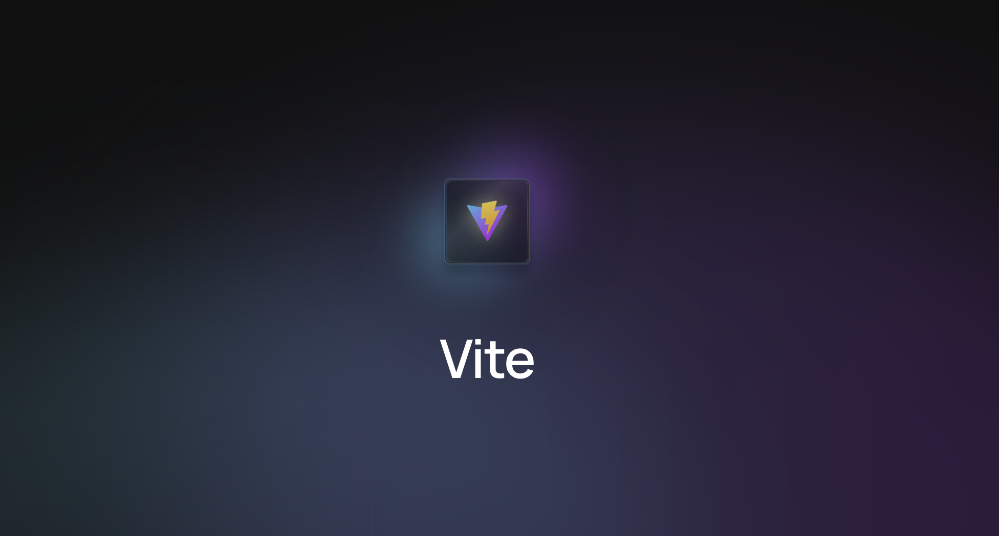

## 들어가기
(비트로 읽어야 하는 걸 알면서도 바이트로 읽게되는...)Vite는 프랑스어로 "빠르다(Quick)"를 의미 합니다. Vue의 창시자 Evan You가 만들었으며 빠르고 간결한 개발 경험에 초점을 맞춘 빌드 도구 입니다.

Vite(프랑스어로 "빠르다(Quick)"를 의미하며, 발음은 "veet"와 비슷한 /vit/ 입니다.)는 빠르고 간결한 모던 웹 프로젝트 개발 경험에 초점을 맞춰 탄생한 빌드 도구이며, 두 가지 컨셉을 중심으로 하고 있습니다: