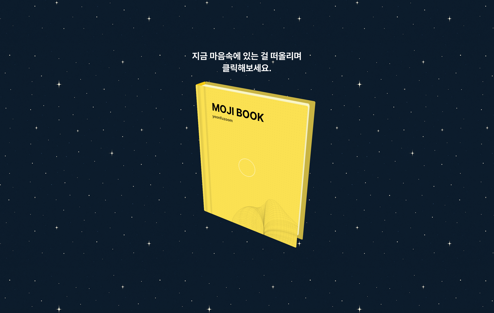

# 조수연  
### frontend developer
{: .info }
  
<!-- {: .prompt-tip } -->
<i class="fa-fw fas fa-envelope"></i> 이메일: [eunhye9450@gmail.com](mailto:eunhye9450@gmail.com)  
<i class="fa-fw fas fa-brands fa-blogger"></i> 블로그: [https://suyeon9456.github.io/](https://suyeon9456.github.io/)  
<i class="fa-fw fas fab fa-github"></i> 깃허브: [https://github.com/suyeon9456](https://github.com/suyeon9456)  

빠르고 안정적인 서비스를 위해 기술 도입과 프로세스 개선을 이끕니다.  
RSC 적용으로 초기 로딩 속도를 개선했고 Sentry 온프레미스 도입을 주도하여 안정적인 오류 모니터링 환경을 구축하고 대응 속도를 높였습니다.

사용자에게 더 나은 경험을 제공하기 위해 고민합니다.  
사용자별로 다른 서브도메인을 사용하는 구조로 인해 사이트맵 제출에 제약이 있었고 이로 인해 검색 인덱싱에 문제가 있었습니다.
이를 개선하기 위해 사이트맵 인덱스를 활용한 교차 제출 방식을 도입한 결과 검색 노출 수가 46% 증가했습니다.

좋은 코드에 대해 고민하고 팀과 소통하며 함께 더 나은 결과를 만들어가는 것을 좋아합니다.  
코드 리뷰와 기술 스터디 운영을 통해 팀과 지속적으로 좋은 코드에 대해 고민해왔습니다. 이 과정에서 커스텀 린트 룰을 정의하고 Git hook에 린트 검사를 연동하여 스타일 불일치 문제를 사전에 방지하고 리뷰 효율을 높였습니다.

---
<section class="experience">
    <article class="title">
        <header>
            <h2 class="title ">경력</h2>
        </header>
    </article>
    <article>
        

            <header>
                <h2 class="ex-title">스티비</h2>
                

                    프론트엔드
                      2022.10. ~ 2024.12. (2년 3개월)
                

            </header>
            

                <!-- 이메일 뉴스레터 제작과 마케팅을 돕는 SaaS 솔루션 ‘스티비’에서 프론트엔드 개발자로 근무하며 뉴스레터  기능 개발 및 기술 환경 개선을 이끌었습니다. -->
                이메일 뉴스레터 제작과 마케팅을 돕는 SaaS 솔루션 ‘스티비’에서 프론트엔드 개발자로 근무하며 뉴스레터 에디터 개선, 이메일 마케팅을 위한 통계 등 핵심 기능 개발과 기술 환경 개선을 주도했습니다

            

            <article>
                

                    <header>
                        <h3 class="project-title">Next.js 버전 업그레이드(12 → 14) 제안 및 주도</h3>
                    </header>
                    

                        <ul>
                            <li>RSC 도입을 통해 기대할 수 있는 JS 번들 크기 감소와 코드의 간결성 및 모듈화 측면의 이점을 고려하여 버전 업그레이드와 App Router 전환을 제안하고 작업 전반을 주도</li>
                            <li>기존에는 getServerSideProps에서 여러 API를 호출해 데이터를 조합했으나 페이지별로 분산된 로직으로 인해 관련 작업의 효율성이 떨어졌고, 이를 Route Handler로 한 곳에서 처리하도록 하여 재사용성과 유지 보수성을 개선</li>
                            <li>
                                백엔드에서 처리하던 사용자-서브 도메인 처리 로직을 Next.js 미들웨어로 옮겨 프론트엔드에서 전적으로 관리할 수 있도록 개선하였고 이를 통해 유지 보수 효율과 디버깅 속도를 높임
                            </li>
                            <li>
                                운영과 QA 서버 간 배포 동작 차이로 인한 예기치 못한 오류를 방지하기 위해 QA의 배포 동작을 운영과 동일하게 수정
                            </li>
                        </ul>
                    

                    

                    <header>
                        <h3 class="project-title">기술 스택 전환 (AngularJS → React)</h3>
                    </header>
                    

                        <ul>
                            <li>AngularJS 프로젝트를 컴포넌트 단위로 점진적으로 마이그레이션하기 위해 특정 DOM 요소에 React 컴포넌트를 독립적으로 렌더링 하는 방식을 사용</li>
                            <li>
                                React와 AngularJs의 상태 공유를 위한 브릿지 모듈 구현
                                <ul>
                                    <li>상태 공유를 위해 전역으로 관리하던 함수를 CustomEvent를 사용하는 방식으로 대체하고 이를 재사용 가능하도록 커스텀 Hook으로 구현</li>
                                    <li>
                                        AngularJS에서 이벤트 수신 후 $scope를 갱신하고 $applyAsync로 변경을 감지해 UI가 정상적으로 업데이트되도록 수정하였으며, 해당 로직은 모듈화하여 AngularJS 컨트롤러에서 쉽게 등록 및 해제할 수 있도록 개선
                                    </li>
                                </ul>
                            </li>
                            <li>
                                모노레포 루트에는 React 17이 설치되어 있었고 특정 패키지만 React 18로 업그레이드하는 과정에서 두 버전의 혼용으로 인한 오류 발생. 이를 해결하기 위해 Vite의 alias 설정을 통해 해당 패키지에서만 React 18을 명시적으로 참조하도록 개선
                            </li>
                        </ul>
                    

                

                

                

                    <header>
                        <h3 class="preject-title">개발경험 개선</h3>
                    </header>
                    

                        <ul>
                            <li>
                                Sentry 도입
                                <ul>
                                    <li>비용 절감 및 보안을 위해 온프레미스 방식으로 적용</li>
                                    <li>beforeSend 기능을 활용해 긴급도 및 중요도가 높은 오류만 Sentry로 전송</li>
                                    <li>
                                        Jenkins 파이프라인에 Sentry CLI 기반 스크립트를 통합하여 빌드시 자동으로 소스맵(Source Map)을 업로드해, 이슈 대응 속도를 높임
                                    </li>
                                    <li>Slack 알림은 특정 조건을 조합해 중요한 이슈만 전송되도록 하였고 동일한 오류로 인한 중복 알림을 방지하기 위해 상황에 따라 threshold 값을 설정해 제한하여 중요 이슈에 집중할 수 있도록 구성</li>
                                </ul>
                            </li>
                        </ul>
                        <ul>
                            <li>
                                디자인 토큰을 기반으로 한 디자인 시스템 구축
                                <ul>
                                    <li>피그마 플러그인을 사용해 디자인 변경 사항을 .json 토큰 파일로 생성한 뒤 토큰 파일을 GitHub에 디자이너 전용 브랜치로 푸시</li>
                                    <li>Token Transformer 및 Style Dictionary 활용해 .json 파일을 코드에서 사용할 수 있는 형식(.ts, .scss, .css 등)으로 변환</li>
                                    <li>
                                        GitHub Actions을 사용해 위 과정에 대한 자동화 워크플로우 구현
                                    </li>
                                </ul>
                            </li>
                        </ul>
                    

                

                

                

                    <header>
                        <h3 class="project-title">SEO 최적화</h3>
                    </header>
                    

                        <ul>
                            <li>
                                AngularJS 프로젝트 내 React 컴포넌트를 부분적으로 렌더링하는 구조에서 동적 OG 태그 적용
                                <ul>
                                    <li>빌드 타임에 Gulp를 이용하여 컨텐츠 별로 다른 OG태그로 설정된 HTML 파일들을 생성</li>
                                    <li>생성된 HTML파일들은 배포 시 AWS의 S3에 업로드</li>
                                    <li>CloudFront Function을 활용해 봇에 의한 요청인 경우, 요청된 URL에 알맞는 OG 태그가 포함된 HTML 파일을 S3에서 찾아 반환하도록 설정</li>
                                </ul>
                            </li>
                        </ul>
                        <ul>
                            <li>
                                사용자마다 다른 서브도메인을 사용하는 구조에서 검색 노출 개선
                                <ul>
                                    <li>
                                        각 서브도메인 마다 아카이빙하고 있는 뉴스레터에 대해 Next.js의 Dynamic Routes를 활용하여 sitemap.xml과 robots.txt를 동적으로 생성
                                    </li>
                                    <li>
                                        Google Search Console의 교차 제출 방식을 활용해 사이트맵 인덱스를 관리
                                    </li>
                                    <li>3개월 후 검색엔진 노출 수 약 46% 증가</li>
                                </ul>
                            </li>
                        </ul>
                    

                

                

                

                    <header>
                        <h3 class="project-title">스티비 전반적인 서비스 개발, 유지보수</h3>
                    </header>
                    

                        <ul>
                            <li>
                                구독자 활동 기반 세그먼트 기능 개발
                                <ul>
                                    <li>
                                        구조가 복잡한 세그먼트 조건을 포맷하는 유틸 함수를 별도로 분리하였고 다양한 입력 케이스를 검증하기 위한 단위 테스트 작성
                                    </li>
                                    <!-- <li>Mixpanel을 연동하여 수집된 데이터를 기반으로 자주 사용하는 세그먼트 조건을 분석하고 이를 바탕으로 반복적으로 활용되는 조건들을 빠르게 선택할 수 있는 세그먼트 템플릿 기능을 추가</li> -->
                                </ul>
                            </li>
                        </ul>
                        <ul>
                            <li>
                                랜딩 페이지 리뉴얼
                                <ul>
                                    <li>랜딩 페이지의 텍스트 및 이미지 컨텐츠를 백오피스에서 관리 가능하도록 구조를 변경하여 개발자 지원 없이 실시간으로 수정할 수 있도록 개선</li>
                                </ul>
                            </li>
                        </ul>
                        <ul class="page-break">
                            <li>
                                백 오피스 정산 프로세스 자동화 기능 기획 및 개발
                                <ul>
                                    <li>운영 담당 팀에서 유료 뉴스레터의 정산을 엑셀로 수작업 처리한 뒤 모든 발행인에게 개별 이메일로 전달하고 있어 업무 처리 시간이 증가하는 문제가 발생</li>
                                    <li>계좌 정보 관리부터 정산서 발급, 이메일 발송까지의 전 과정을 백 오피스에서 직접 처리할 수 있도록하는 기능 추가 제안</li>
                                    <li>사용자의 직관적인 이용을 목표로 피그마를 활용해 초기 UI/UX를 설계하고 내부 피드백을 통해 개선 방향을 도출</li>
                                    <li>계좌 정보 등록, 승인, 정산서 생성, 메일 전송, 정산 완료의 업무 프로세스를 기반으로 실제 업무 흐름에 맞춘 UI 화면을 설계</li>
                                </ul>
                            </li>
                        </ul>
                    

                

            </article>
        

    </article>
</section>
---

<!-- <section class="project">
    <article class="title">
        <header>
            <h2 class="title">프로젝트</h2>
        </header>
    </article>
    <article>
        

            <header>
                <h2 class="project-title">기술 스택 전환 및 업그레이드</h2>
            </header>
            

            <ul>
                <li>버전 업그레이드 제안 및 주도 Next.js 12 -> 14</li>
                <ul>
                    <li>
                        App Router 도입 및 마이그레이션 (app 디렉토리 기반)
                    </li>
                    <li>
                        기존 백엔드에서 처리하던 서브도메인-사용자 매핑 로직을 Next.js 미들웨어로 이전하여 프론트엔드 서버에서 처리하도록 개선
                    </li>
                    <li>next/font/local 활용하여 웹 폰트 로딩 최적화 및 초기 렌더링 성능 개선</li>
                    <li>
                        배포 파이프라인 표준화 (운영/QA 환경 간 배포 방식 통일)
                    </li>
                    <li>
                        모노레포 환경에서의 다중 React 버전 충돌 문제 해결
                    </li>
                </ul>
            </ul>
                <ul>
                    <li>기술 스택 전환 AngularJs -> React</li>
                    <ul>
                        <li>React 컴포넌트를 독립적으로 렌더링하여 핵심 페이지부터 우선적으로 전환하는 방식으로 점진적인 마이그레이션 진행</li>
                        <li>React에서 AngularJs로 데이터를 전달하기 위해 전역에서 관리되던 함수 사용대신 CustomEvent를 사용하는 방식으로 대체하고 이를 재사용할 수 있도록 커스텀 React 훅으로 구현</li>
                        <li>공통된 오류 처리와 사용자 경험 향상을 위해 ErrorBoundary 컴포넌트를 적용</li>
                        <li>공통으로 사용하는 UI 컴포넌트 설계</li>
                    </ul>
                </ul>
            

        

        

        

            <header>
                <h2 class="preject-title">개발경험 개선</h2>
            </header>
            

                <ul>
                    <li>
                        Sentry 도입
                        <ul>
                            <li>비용 절감 및 데이터 보안을 위해 온프레미스 방식으로 적용</li>
                            <li>beforeSend 기능 활용해, 긴급도 및 중요도가 높은 오류만 Sentry로 전송</li>
                            <li>
                                Jenkins 파이프라인에 Sentry CLI 기반 스크립트를 통합하여 빌드시 자동으로 소스맵(Source Map)을 업로드해, 디버깅 용이성을 높임
                            </li>
                            <li>Slack 알림 설정으로 오류 발생 시 즉각 대응</li>
                        </ul>
                    </li>
                </ul>
                <ul>
                    <li>
                        디자인 토큰을 기반으로 한 디자인 시스템 구축
                        <ul>
                            <li>피그마 플러그인을 사용해 디자인 변경 사항을 .json 토큰 파일로 생성한 뒤, 토큰 파일을 GitHub에 디자이너 전용 브랜치로 푸시</li>
                            <li>Token Transformer 및 Style Dictionary 활용해, .json 파일을 코드에서 사용할 수 있는 형식(.ts, .scss, .css 등)으로 변환</li>
                            <li>
                                GitHub Actions을 사용해, 위 과정에 대한 자동화 워크플로우 구현
                            </li>
                        </ul>
                    </li>
                </ul>
            

        

        

        

            <header>
                <h2 class="project-title">SEO 최적화</h2>
            </header>
            

                 <ul>
                    <li>
                        AngularJs 기반 + React 부분 렌더링 환경에서 동적 OG 태그 적용
                        <ul>
                            <li>AWS CloudFront Function을 활용해 요청된 URL에 맞는 동적 OG 태그가 포함된 HTML을 반환하도록 설정</li>
                        </ul>
                    </li>
                </ul>
                 <ul>
                    <li>
                        사용자 별 각각의 서브 도메인에 대한 검색엔진 최적화를 위한 사이트맵 관리와 개선
                        <ul>
                            <li>
                                next.js의 Dynamic Routes 이용해, 서브도메인별로 동적으로 사이트맵과 robots.txt를 생성 및 관리
                            </li>
                            <li>
                                Google Search Console의 교차 제출 방식을 활용해 사이트맵 인덱스를 관리
                            </li>
                            <li>
                                Google Search Console 데이터를 주기적으로 확인해 크롤링 및 색인 상태를 점검
                            </li>
                            <li>3개월 후, 검색엔진 노출 수 약 46% 증가</li>
                        </ul>
                    </li>
                </ul>
            

        

        

        

            <header>
                <h2 class="project-title">스티비 전반적인 서비스 개발, 유지보수</h2>
            </header>
            

                 <ul>
                    <li>
                        구독자 활동 기반 세그먼트 기능 개발
                        <ul>
                            <li>세그먼트 조건을 설정하는데 필요한 Cascader, Select, DatePicker를 재사용 가능한 공통 컴포넌트로 설계 및 제작</li>
                            <li>세그먼트 조건 선택에 대한 Jest와 React Testing Library를 사용하여 단위 테스트 작성</li>
                            <li>Mixpanel을 연동하여 사용자 이벤트 데이터를 수집</li>
                        </ul>
                    </li>
                </ul>
                 <ul>
                    <li>
                        이메일 통계 페이지 개발
                        <ul>
                            <li>chart.js 사용해 구독자 수, 일메일 발송 성공 등 그래프 구현</li>
                            <li>이메일 태그, 주소록 별 통계를 조회할 수 있도록 기능 개선</li>
                        </ul>
                    </li>
                </ul>
                <ul>
                    <li>
                        랜딩 페이지 리뉴얼
                        <ul>
                            <li>tab, click, hover, 인터렉션 적용</li>
                            <li>slider, auto-rolling 등 애니메이션 적용</li>
                            <li>반응형 적용</li>
                        </ul>
                    </li>
                </ul>
                <ul>
                    <li>
                        백 오피스 정산 프로세스 자동화 기능 기획 및 개발
                        <ul>
                            <li>유료 뉴스레터를 운영하는 사용자에게 정산서를 발급하는 과정을 백 오피스에서 자동화</li>
                            <li>기획, UI 디자인, 프론트엔드 개발 담당</li>
                        </ul>
                    </li>
                </ul>
            

        

    </article>
</section> -->
<!-- <section class="other-experience">
    <article class="title">
        <header>
            <h2 id="title">대외활동</h2>
        </header>
    </article>
    <article>
        

            <header>
                <h3 id="title">블랙커피 레벨1 13기</h3>
                
2022.02. ~ 2022.02. (1개월)

            </header>
            <ul>
                <li>
                    moonbucks-menu 개발
                    <ul>
                        <li>VanillaJS를 이용하여 상태관리가 가능한 애플리케이션 개발</li>
                        <li>팀원들과의 코드리뷰를 통해 협업하여 클린코드가 가능하게 수정</li>
                        <li>pub sub 패턴으로 개발</li>
                        <li>페어프로그래밍을 통해 팀원과 협력하여 주어진 과제 해결</li>
                        <li>Cypress 로 E2E 테스트코드 작성</li>
                    </ul>
                </li>
            </ul>
        

        

            <header>
                <h3 id="title">외부 스터디</h3>
            </header>
            <ul>
                <li>모던 JavaScript 스터디</li>
                <li>알고리즘 스터디</li>
            </ul>
        

        

            <header>
                <h3 id="title">사내 뉴스레터 에디터 활동</h3>
            </header>
            <ul>
                <li>beletter 에디터</li>
            </ul>
        

    </article>
</section> -->
<!-- 
---
{: .line } -->

## 기술 스택 
{: .tech-title}

프론트엔드

`React` `Next.js` `TypeScript` `react-query` `zustand` `Redux` `styled-components` `AngularJs`

클라우드 및 배포

`EC2` `S3` `CloudFront`

---

## 상세 경력사항
{: .curriculum_title}

### **Next.js 버전 업그레이드 주도**
##### 개요 
기존 뉴스레터를 아카이브하고 열람할 수 있는 프로젝트는 Next.js 12 버전으로 운영되고 있었으나 최신 기술 도입과 장기적인 유지 보수를 위해 Next.js 14 버전으로 업그레이드를 제안하였습니다. 특히 App Router 도입과 서버 컴포넌트를 활용한 JS 번들 크기 감소와 코드의 간결성 및 모듈화 측면 등의 이점을 고려하여 제안하였고 프로젝트 전반의 구조 개선과 배포 과정 개선까지 진행하게 되었습니다.
<!-- 기존의 사용자별 뉴스레터 아카이빙 페이지는 Next.js 12 버전으로 운영되고 있었지만 최신 기술 도입과 장기적인 유지보수를 위해 Next.js 14 버전으로 업그레이드가 필요하다고 판단했습니다. 업그레이드를 통해 기대할 수 있는 개선 사항들을 정리해, 팀에 제안 하였고 제안이 수용된 이후에는 프로젝트의 버전 업그레이드를 주도하며 그간 개선이 필요했지만 시간적인 문제로 진행하지 않았던 배포 환경 통일 등 개선 사항들을 함께 진행하게 되었습니다. -->

##### 작업 내용
프로젝트 특성상 서버에서 데이터를 가져와 콘텐츠를 보여주는 정적 UI가 많았기 때문에 이러한 부분은 서버 컴포넌트로 구성하여 초기 렌더링 시점에 바로 표시되도록 했습니다. 반면 초기 렌더링 시 꼭 필요하지 않은 모달 등의 컴포넌트는 dynamic import를 통해 지연 로딩되도록 구성하여 성능을 최적화했습니다. 또한 기존 Page Router 구조에서는 페이지와 관련된 컴포넌트들을 별도 디렉토리에서 관리해야 했기 때문에 UI 구성 요소들이 물리적으로 분산되어 가독성과 유지 보수에 좋지 않다는 생각이 들었습니다. 이를 개선하기 위해 Next.js의 App Router로 전환하고 코로케이션 전략을 도입했습니다. 그 결과 loading.tsx, error.tsx 등 예약 파일명을 사용한 컴포넌트들뿐만 아니라 관련도가 높은 컴포넌트를 동일 디렉토리에 배치함으로써 코드의 응집도를 높이고 구조를 보다 직관적으로 개선할 수 있었습니다.

<!-- App Router로의 전환 과정에서 layout.js를 활용하여 변동이 적은 UI를 처리하도록 설계함으로써 코드 중복과 렌더링을 줄일 수 있었습니다. 또한 상호작용이 필요한 컴포넌트를 제외한 나머지 부분은 클라이언트 컴포넌트로 데이터 fetch가 필요한 부분은 서버 컴포넌트로 생성하여 클라이언트로 전송되는 JavaScript의 양을 최소화했습니다. 반복되는 작업을 줄이기 위해 codemod를 활용해 Link 컴포넌트 내 a 태그를 제거하는 등의 작업을 자동화 하였습니다. -->

기존에는 서브도메인과 사용자의 주소록을 백엔드 서버에서 매칭한 뒤 Next.js 서버로 주소록 ID가 포함된 url을 전달받는 구조였습니다. 이로 인해 매 요청마다 의존성이 생겼고 페이지가 로드되지 않는 이슈가 발생할 경우 프론트엔드와 백엔드 모두를 확인해야 하는 불편함이 있었습니다. 이를 개선하기 위해 서브도메인과 주소록 매칭 로직을 Next.js의 Middleware에서 처리하도록 변경하여 프론트엔드에서 전적으로 관리할 수 있도록 했습니다. 그 결과 유지 보수 효율성과 디버깅 속도를 높일 수 있었습니다.

QA 서버 배포 시스템에서도 변화를 주었습니다. 운영 환경에서는 Docker로 빌드한 이미지를 AWS ECR에 버전 명을 포함한 이름으로 업로드하고, 이를 AWS ECS를 통해 배포하고 있었습니다. 반면 QA 환경에서는 EC2 인스턴스에서 pm2를 이용해 애플리케이션을 실행하는 방식으로 배포를 진행했습니다. 이로 인해 QA 환경에서 배포과정에서는 발견되지 않았던 문제가 운영 환경에서 배포 시 종종 발생했습니다. 이러한 문제를 해결하기 위해 QA 환경의 배포 방식을 운영 환경과 동일하게 변경하였습니다. 이로써 환경 간 불일치를 해소하고 배포 과정에서 발생할 수 있는 잠재적인 문제를 사전에 방지할 수 있었으며 보다 안정적이고 신뢰할 수 있는 배포 파이프라인을 구축했습니다.

---

### **AngularJS 프로젝트 내 React 컴포넌트를 부분적으로 렌더링 하는 구조에서 동적 랜딩 페이지 url 별 OG 태그 적용**
<!-- Angular 기반 애플리케이션에서 React로 점진적으로 마이그레이션 중인 가운데, Open Graph(OG) 메타 태그가 고정되어 있어 SNS 공유 시 랜딩의 각 서브 페이지에 맞는 OG 태그를 노출하는 데 문제가 있었습니다. 이에 **AWS CloudFront Function을 활용해 크롤러 요청 시 URL에 맞는 OG 태그가 포함된 HTML을 반환하도록 구성**하였고 이를 통해 **SEO 및 SNS 공유 최적화** 문제를 효과적으로 해결했습니다. -->

##### 개요
AngularJs에서 React로 점진적으로 마이그레이션하는 과정에서 OG 태그가 정적으로 고정되어 있어 SNS 공유 시 각 URL에 맞는 미리보기가 제대로 표시되지 않는 문제가 발생했습니다.

##### 작업 내용
React-Helmet과 CSR의 사전 렌더링을 도와주는 React-Snap으로 테스트했으나 AngularJS 프로젝트 내에서 React 컴포넌트를 특정 DOM 요소에 마운트 하는 구조에서는 적용하기 어려웠습니다. React-Snap은 React Router를 기반으로 각 경로에 해당하는 화면을 사전 렌더링 하는 방식이지만 당시 프로젝트에서 React는 하나의 루트를 기준으로 애플리케이션을 구성하고 있지 않았습니다. 또한 React 컴포넌트는 AngularJs 페이지가 로드된 후 마운트 되는 구조였기 때문에 React-Snap이 페이지를 탐색하고 렌더링 할 때 OG 태그를 포함한 컴포넌트가 표시되지 않아 사전 렌더링된 HTML에 포함될 수 없었습니다.

다른 방법을 찾아보던 중 AWS의 edge Function을 활용해 요청(Request)에 대한 응답(Response)을 생성하거나 수정하는 내용에 관한 글을 접하게 되었습니다. 이후 AWS CloudFront Function을 활용해 요청된 URL 경로에 따라 알맞은 HTML을 반환하는 방식으로 테스트해 문제 해결 가능성을 확인했습니다. AWS의 또 다른 edge Function인 Lambda@Edge로도 테스트를 해보았으나 CloudFront Function이 약 1/6의 비용으로 비용 효율성이 높고 구현이 간단한 장점이 있어 최종적으로 선택했습니다.

가능성을 확인한 후 각 페이지에 맞는 OG 태그가 포함된 HTML을 생성하기 위해 빌드 단계에서 Gulp를 활용하였으며 생성된 HTML 파일들은 S3에 업로드하였습니다. CloudFront Function에서는 특정 URL 요청을 트리거로 동작하도록 설정했으며 Request의 User-Agent가 Bot일 경우 URL 경로에 알맞은 OG 태그가 포함된 HTML을 반환하도록 구성했습니다.

<!-- ##### 성과 
- SEO 및 SNS 공유 최적화 문제 해결 -->

---

### **사용자마다 다른 서브도메인을 사용하는 구조에서 검색 노출 개선**

##### 개요
사용자별로 다른 서브도메인을 사용하는 뉴스레터 아카이브 페이지가 검색엔진에 잘 노출되지 않는다는 문제를 확인하게 되었습니다. 구글 서치 콘솔에서 확인한 결과 제출된 사이트맵의 구조가 표준을 따르지 않고 있었습니다. 이로 인해 검색엔진 노출의 대부분이 외부 백링크를 통한 접근에만 의존하고 있었습니다.

##### 작업 내용
문제를 해결하기 위해 구글에서 제공하는 문서를 살펴보며 비슷한 환경을 제공하고 있는 다른 서비스들의 사이트맵도 찾아보게 되었습니다. 그 과정에서 사이트맵 인덱스 파일로 여러 개의 사이트맵을 교차 제출하는 방법에 대해 알게 되었습니다. 사이트맵 인덱스는 여러 개의 사이트맵 URL을 하나의 XML 파일로 묶어 제공하는 방식으로 서브도메인별 사이트맵을 통합 관리할 수 있었습니다. 

해당 구조를 적용하기 위해 모든 서브도메인 URL을 수집해 하나의 파일로 만들어야 했습니다. 서브도메인의 수가 많고 주기적인 업데이트가 필요했기 때문에 수작업으로 처리하기에는 비효율적이라고 판단하여 작업을 셸 스크립트로 구현하였습니다. 생성된 사이트맵은 루트 도메인의 사이트맵 경로에 등록해 검색엔진에 제출하였고, 그 결과 3개월 후 검색엔진 노출 수가 약 46% 증가한 것을 확인할 수 있었습니다.

---

### **Sentry 도입**

<!-- ##### 개요
기존에는 예기치 못한 오류가 발생하면 서버 로그를 확인해, API 요청 및 응답 상태를 확인하거나 사용자에게 개발자 도구 콘솔에 표시되는 오류 메시지 스크린샷을 요청하는 등 불편함이 있었습니다. 이러한 문제점을 해결하기 위해 Sentry 도입을 추진하였고 **오류 모니터링 및 디버깅 프로세스 개선**과 **사용자 경험 및 개발자 경험 향상**을 목표로 진행하였습니다. -->

##### 개요
기존에는 예기치 못한 오류가 발생했을 때 서버 로그를 직접 확인하거나, 경우에 따라 사용자에게 개발자 도구의 콘솔 메시지 확인을 요청하는 등의 번거로운 절차가 필요했습니다. 이러한 방식은 오류를 신속하게 파악할 수 없게 했으며 문제 해결이 지연되는 동안 동일한 오류를 겪는 사용자가 늘어났습니다.

##### 작업 내용
오류를 빠르게 파악할 수 있는 도구를 도입하기로 결정하면서 Sentry와 Datadog을 비교하게 되었습니다. Sentry는 오류 추적에 특화된 도구로 애플리케이션에서 발생하는 문제를 신속하게 파악하고 대응하는 데 효과적이었습니다. Datadog 역시 오류 정보를 수집하지만 디버깅보다는 성능 지표나 로그 분석에 더 중점을 둔 도구라는 점을 확인하였습니다. 이러한 이유로 Sentry를 도입하기로 결정했습니다.

Sentry 도입을 결정한 이후 Cloud 방식과 On-Premise 방식 중 어떤 형태가 더 적합한지 비교하게 되었습니다. Cloud 방식은 설치나 유지 보수가 필요 없어 초기 도입 속도가 빠른 장점이 있었지만, 비용 절감과 수집되는 정보의 보안을 위해 사내 인프라에서 관리하는 On-Premise 방식이 더 적합하다고 판단했습니다. 결정한 후 Sentry에서 제공하는 Docker 기반의 설치 레포지토리를 활용해 AWS EC2 인스턴스에 Sentry 환경을 구축했습니다. 

beforeSend 기능을 활용하여 로그 레벨이 error 또는 fatal인 항목만 전송되도록 설정하고 중요도가 높은 특정 에러 코드만 필터링하여 수집했습니다. 이를 통해 Sentry에 우선순위가 높은 오류를 전달하여 모니터링 효율성을 개선했습니다. 또한 오류를 빠르게 분석할 수 있도록 소스 맵(Source Map)을 제공하여 개발자 경험(DX)을 향상시켰습니다. 이후 Jenkins 파이프라인에 Sentry CLI 기반 스크립트를 추가해 빌드 시 소스 맵이 자동으로 업로드되도록 구성하였습니다.

오류 발생 시 슬랙 채널로 알림이 전송되도록 설정했으며 태그나 에러 코드 등의 조건을 조합하여 중요한 이슈만 선별적으로 전달되도록 구성하였습니다. 또한 동일한 오류로 인한 중복 알림을 방지하기 위해 상황에 따라 threshold 값을 설정하여 중요 이슈에 집중할 수 있도록 하였습니다.

<!-- ##### 성과
- 오류 모니터링 및 디버깅 프로세스 개선
- 문제 해결 시간 단축
- 사용자 경험(UX) 및 개발자 경험(DX) 향상 -->

---

### **디자인 토큰을 기반으로 한 디자인 시스템 구축**
<!-- ##### 개요
팀 규모가 커지면서 스프린트 진행중 추가되는 컬러나 타이포그래피에 대한 프론트 팀과 디자이너 팀 간의 명명 차이가 발생했습니다. 이러한 문제를 해결하기 위해 **design token을 기반으로한 디자인 시스템 구축**과 **컬러나 타이포그래피에 대한 수정/추가/삭제가 자동화**되는 것을 목표로 진행했습니다. -->

##### 개요
스프린트 진행 중 컬러, 타이포그래피, 컴포넌트 variant 등의 스타일 요소가 추가되면서 프론트엔드 팀과 프로덕트 디자이너 간에 명명 방식 차이로 인해 커뮤니케이션 비용이 증가했습니다. 또한 디자이너가 코드 수정 없이 스타일을 직접 관리할 수 없는 구조도 생산성이 낮아지는 원인이 되었습니다. 이러한 문제를 개선하고 스타일 정의의 일관성을 유지하기 위해 디자인 토큰을 도입하게 되었습니다.

##### 작업 내용

github에 디자이너팀이 사용할 수 있는 브랜치를 생성하였고 피그마에서 디자이너가 디자인 설정을 변경하면 그것에 대한 변경된 토큰이 피그마 플러그인을 통해 생성한 브랜치로 push 할 수 있도록 하였습니다. 토큰 파일(.json)은 token-transformer와 style-dictionary로 json, ts, scss, css 등 코드에서 사용할 수 있는 파일로 변환했습니다.

이 과정을 수동으로 하게 됐을때 여전히 불편함이 존재했습니다. 이를 자동화하기 위해 github actions을 사용했습니다. 변경된 토큰이 push 되면 github actions을 실행해 token-transformer와 style-dictionary 를 순차적으로 실행하여 변환한 파일을 생성하고 생성된 파일들은 자동으로 commit 및 push 하여 개발 브랜치로 Pull Request를 생성할 수 있도록 스크립트를 작성했습니다.

당시에는 디자인 설정 변경 시 변경된 토큰 파일만 적용하는 방식으로 처리했지만 지금 다시 작업하게 된다면 토큰의 이름이 변경됐을 때 codemod를 활용해 이를 참조하고 있는 코드 전반을 일괄적으로 변경해 Pull Request를 생성할 수 있도록 개선할 것 같습니다.

<!-- 
**디자인 토큰 기반 디자인 시스템 도입**
- 디자이너 전용 GitHub 브랜치 생성해, Figma 플러그인을 통해 토큰 파일(.json) 직접 push 가능
- 토큰 파일(.json)은 token-transformer와 style-dictionary를 통해 다양한 형식(ts, scss, css)으로 변환

**자동화 프로세스 구축**
- GitHub Actions 활용
    - 디자이너가 토큰을 브랜치에 push → 자동으로 파일 변환 스크립트 실행
    - 변환된 파일 자동 commit 및 push해 개발 브랜치로 Pull Request 생성 -->

<!-- ##### 성과
- 디자이너가 직접 컬러, 타이포그래피를 추가 및 수정 가능
- 디자인 팀과 프론트엔드 팀 네이밍 일관성을 높여 협업 효율 및 유지보수성 개선
- 반복 작업 자동화로 생산성 향상 -->

---

### **정산 프로세스 자동화 기능 기획 및 개발**
##### 개요
기존 운영팀은 유료 뉴스레터 관련 정산서를 발급하기 위해 엑셀로 정산 데이터를 수기 관리하고 개별 이메일을 통해 정산서를 발송하는 방식으로 업무를 처리하고 있었습니다. 이 과정은 반복적인 업무가 많아 오류 발생 가능성이 높아졌고 운영팀의 업무 효율에 문제가 되었습니다. 정산 프로세스를 간소화하고 자동화하기 위해 백오피스에 기능 추가를 기획하고 UI 설계부터 개발까지 전담하여 구현했습니다.

<!-- ##### 진행 과정
백오피스의 주요 사용자인 운영팀과의 논의를 통해 요구사항을 상세히 분석한 뒤, 업무 흐름을 시각적으로 정리하고 이를 기반으로 피그마를 활용해 UI를 설계했습니다. 설계된 UI는 운영팀과 공유하며 피드백을 적극적으로 반영했으며 백엔드 개발자와 협력해 필요한 API를 정의하고 기능을 구현했습니다. -->

##### 작업 내용
기획 단계에서 운영팀과 인터뷰를 진행하며 정산 업무의 절차와 반복 작업을 파악하였고 이를 토대로 업무 흐름을 유저 플로우로 시각화하여 기능 요구사항을 정리했습니다. 유저 플로우를 바탕으로 피그마를 활용해 UI를 설계했습니다. 이 과정에서 중요하게 고려한 점은 정산 담당자가 실제 업무 흐름에 따라 기능을 직관적으로 사용할 수 있도록 하고 최소한의 조작으로 업무를 원활하게 수행할 수 있도록 구성하는 것이었습니다.

UI 설계가 완료된 후 백엔드 개발자와 함께 필요한 데이터를 논의해 API 명세를 정의하였습니다. 이후 Swagger를 기반으로 API 문서를 공유하고 요청 파라미터, 응답 형식, 에러 케이스 등을 사전에 명확히 정리하여 커뮤니케이션이 원활하게 될 수 있도록 하였습니다.

이후 실제 기능 개발 단계에서는 정산 진행 상황을 한눈에 파악할 수 있도록 각 정산 단계에 따른 업무 상태를 시각적으로 구분하여 구현했습니다. 미지급 사용자와 같은 예외 케이스는 필터링 기능을 통해 쉽게 분류하고 확인할 수 있도록 처리하였습니다.  더불어  반복적인 수작업을 줄이기 위해 다중 선택 기반의 정산서 일괄 생성 및 이메일 발송 기능을 개발하였습니다. 또한 발송이 완료되면 슬랙으로 알림이 전송되도록 연동하여 실시간으로 작업 결과를 확인할 수 있도록 구성하였습니다. 

<!-- ##### 성과 및 효과
- 운영팀 정산 업무 시간 단축 -> 업무 효율성 향상 -->

--- 
<!-- {: .page-break} -->
<!-- 

 -->
## 포트폴리오
{: .portpolio}
#### **모지북** ([https://mojibook.vercel.app](https://mojibook.vercel.app))

{: .portpolio-img}

2025.04. ~ 진행중

**주제**: Open AI를 사용해 마음속 고민에 대한 해답을 얻을 수 있는 서비스입니다.

**개발**
- NextJs로 프로젝트를 구축하였습니다.
- Open AI를 연동해 모지북 클릭 시 랜덤으로 마움속 고민에 대한 해답, 조언을 받아올 수 있도록 구현하였습니다.
- framer-motion을 사용해 모지북을 3D로 구현하였습니다.
- framer-motion을 사용해 모지북에 다양한 인터랙션을 주었습니다.
  - hover시 3D 공간 안에서 입체적으로 회전되도록 구현했습니다.
  - 책을 클릭하면 책이 넘어가는 듯한 flip 효과를 주었습니다.
  - 모바일 화면에서 화면을 기울이면 책도 같이 기울어지는 tilt 효과를 주었습니다.
  - 모든 환경에서 일관된 인터랙션을 보장하기 위해 middleware에서 클라이언트의 디바이스 유형을 판별한 후 각 기기에서 동일한 방식으로 인터랙션 로직이 작동할 수 있도록 설정하였습니다.
- 카카오톡 공유 기능을 추가해, 공유된 url로 접속하면 supabase 에 저장된 해당 메시지를 받아와 화면에 표시할 수 있도로 구현하였습니다.

**기술 스택**
{: .tech-title}

`Next.js` `Typescript` `react-query` `framer-motion` `tailwindcss` `supabase`

<!-- #### **health-friends**

2020.01. ~ 2021.03.  

**주제**: 이용하고 있는 헬스장에서 함께 운동할 수 있는 친구를 매칭하는 서비스 입니다.

**개발**
- NextJs, Express 프레임워크로 구축하였습니다.
- Redux를 이용하여 상태관리를 하고 있고 Redux-Toolkit을 사용하여 불필요한 보일러플레이트 코드를 줄이고 Redux 사용 시, 필요한 라이브러리를 내장된 메들웨어를 통해 의존성을 줄였습니다.
- react-query를 통해 Store의 역할이 비대해 지는 것을 방지하고 데이터 업데이트 및 관리 및 lazy data등의 Server State를 관리하고 처음 Redux와 함께 사용했던 Redux-Saga를 제거하였습니다.
- 공통으로 사용하고 있는 커스텀 대화상자를 사용할 때 사용하는 컴포넌트 마다 state가 필요했던 기존 환경을 contextAPI와 react portal을 통해 global 모달로 리팩토링하였습니다.
- AWS EC2를 통해 배포하였고 Lamda를 사용해 S3이미지 업로드 시, 이미지 리사이징을 하여 이미지 용량을 줄이고 Cloud Front를 통해 캐싱된 이미지를 불러와 웹 로드 시간을 단축하였습니다.
- 디자인 시스템 구축
    - Atomic 디자인 시스템으로 재사용 가능한 작은 단위로 UI 컴포넌트들을 구성하여 효과적인 인터페이스 시스템을 구축하였습니다.
- TDD 환경 구축
    - Jest와 React Testing Libary를 사용하여 unit 테스트 환경을 구축하였습니다.

**기술 스택**
{: .tech-title}

프론트엔드

`Next.js` `TypeScript` `react-query` `Redux` `ReduxSaga` `Redux-Tookit`

백엔드

`Node.js` `express` `sequelize`

데이터베이스

`MySql` `RDS`

클라우드 및 배포

`EC2` `S3` `CloudFront`

<i class="fa-fw fas fab fa-github"></i> 깃허브: [health-friends](https://github.com/suyeon9456/health_friends)  
<i class="fa-fw fas fa-brands fa-blogger"></i> 블로그: [health-friends 정보](https://www.notion.so/HEALTH_FRIENDS-ecaae7bdb9ad45bb894aa5fed359cc02) -->

