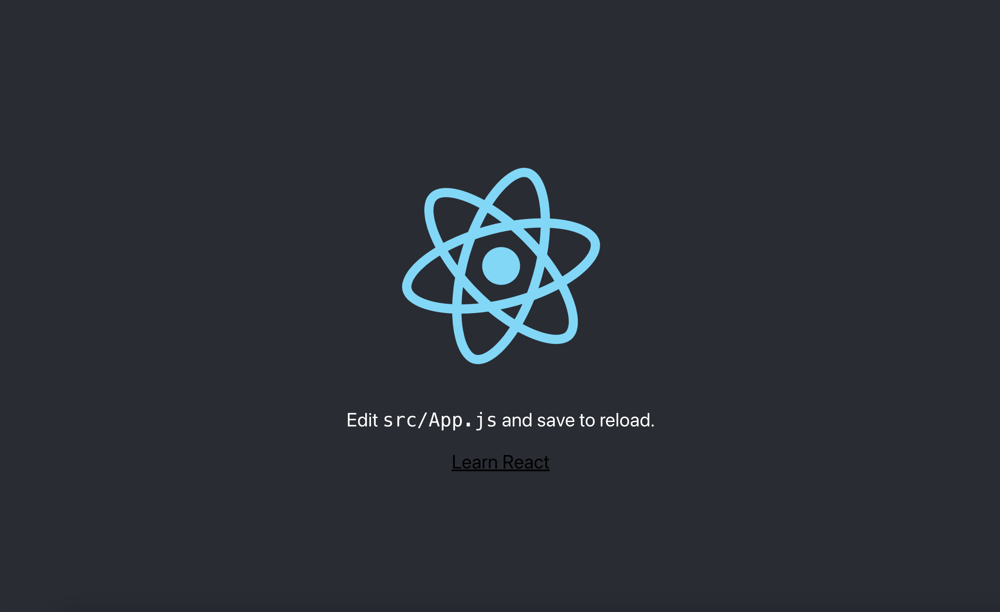
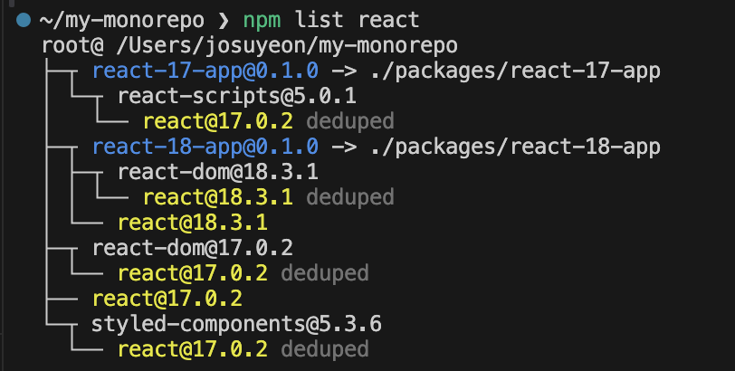

## 모노레포란?
모노레포는 여러 프로젝트를 하나의 저장소에서 관리하는 단일 레포를 의미합니다. 멀티레포는 각 프로젝트를 별도의 저장소로 분리하며 관리하는데, 이와는 대조적입니다. 모노레포는 일반적으로 규모가 크거나 복잡한 프로젝트를 관리할 때 효율적인 구조이며, 규모가 큰 프로젝트이거나 협업에 유용합니다.

모노레포는 어쩌다 생겼을까?
모놀리식 애플리케이션(monolithic application)의 한계에 대한 비판에서 부터 시작합니다. 
모놀리식 애플리케이션은 

> In software engineering, a monolithic application describes a software application that is designed as a single service. 

단일 서비스로 설계된 소프트웨어 애플리케이션입니다. 애플리케이션의 모든 부분이 하나로 연결되어 작동하며, 코드 전체가 하나의 패키지로 빌드되고 배포됩니다. 즉, 모듈화 없이 설계된 구조의 애플리케이션을 의미합니다.

> Monolith applications are relatively simple and have a low cost but their shortcomings are lack of elasticity, fault tolerance and scalability.

상대적으로 간단하고 비용이 저렴하지만 탄력성, 내결함성 및 확장성이 부족하다는 단점이 있습니다. 이로 인한 대안으로 나온 구조는 모노레포와 멀티레포 입니다.

### 모노레포와 멀티레포의 차이

| 항목 | 멀티레포 | 모노레포 |
|-----------|-----------|-----------|
| 구조  | 독립적인 저장소 여러개  | 단일 저장소  |
| 의존성 관리  | 저장소 간 의존성 관리 필요  | 저장소 내에서 의존성 관리 가능  |
| 확장성  | 저장소가 많아질수록 복잡성 증가  | 저장소 크기가 커지면 성능 문제가 생길 수 있음  |
| 팀 독립성  | 높음  | 낮음(코드베이스 공유)  |


서비스 간 독립성이 중요하거나 의존성이 낮은 경우에는 멀티 레포가 적합할 수 있습니다. 그러나 

## 어쩌다 리액트 버전을 다중으로 사용하게 되었을까?

모노레포 환경에서 모든 워크스페이스가 동일한 리액트 버전을 사용하는 것이 이상적이지만, React나 Next.js와 같은 주요 프레임워크의 경우 모든 패키지를 한꺼번에 업그레이드하기보다는 점진적으로, 개별적으로 업그레이드해야 하는 상황이 발생할 수 있습니다. 제 경우가 바로 그러했습니다. 리액트 17 버전을 사용하는 다른 워크스페이스들은 그대로 유지한 채, 특정 워크스페이스만 최신 리액트 버전으로 업그레이드해야 했습니다.

## 테스트 해보기

### root package.json에 리액트 17 버전을 설치하고, 리액트 18 버전은 react-18-app 워크스페이스에 별도로 설치

테스트 환경은 아래와 같이 세팅합니다.
```
├── node_modules/
├── packages/
│   ├── react-17-app/
│   └── react-18-app/
│       ├── node_modules/
│       ├── public/
│       ├── src/
│       ├── .gitignore
│       ├── package.json -> react@18.x, react-dom@18.x
│       └── README.md
├── .gitignore
├── lerna.json
├── package.json -> react@17.x, react-dom@17.x
└── yarn.lock
```

이대로 실행을 해보면...

매우 잘되는 것을 확인할 수 있죠.

그럼 이제 더 정확한 재현을 위해 root에 styled-components v5.3.6(react 17 버전 지원) 버전으로 설치합니다.

다시 애플리케이션을 확인해보면, 정상적으로 렌더링되지 않고 흰 화면과 함께 아래와 같은 오류가 발생하는 것을 볼 수 있습니다.

> Uncaught Error: Invalid hook call. Hooks can only be called inside of the body of a function component. This could happen for one of the following reasons:
> 1. You might have mismatching versions of React and the renderer (such as React DOM)
> 2. You might be breaking the Rules of Hooks
> 3. You might have more than one copy of React in the same app

오류 내용을 확인해보면 3번이 우리의 상황과 동일한 것을 예측해 볼 수 있습니다.

### 그럼 이런 문제는 왜 발생할까요? 🧐

먼저 [리액트 공식 문서](https://legacy.reactjs.org/warnings/invalid-hook-call-warning.html)를 확인해보면 
> In order for Hooks to work, the react import from your application code needs to resolve to the same module as the react import from inside the react-dom package.
>
> React에서 Hooks가 제대로 작동하려면, 애플리케이션 코드에서 가져오는 react 모듈이 react-dom 패키지 내부에서 사용하는 React 모듈과 같은 모듈로 해결(resolved)되어야 합니다.

위 내용을 살펴보면, react와 react-dom은 서로 독립적인 패키지입니다. react는 더 나은 User Interface를 만들기 위한 Javascript 라이브러리이며, react-dom은 react와 함께 사용되어 브라우저 환경에서 작동하도록 도와줍니다.

즉, react와 react-dom은 서로 같은 React 인스턴스를 공유하면서 동작해야 합니다. 여기서 "같은 React 인스턴스"란, 같은 메모리 공간에서 로드된 단일 React 모듈을 의미합니다.

위 내용에 해당하는지 확인을 위해 프로젝트의 의존성 트리를 확인해볼까요?
{: width="400" height="300"}

react-18-app 워크스페이스에서는 react 18버전 이상을 사용하고 있지만 styled-components에서는 react 17버전을 참조하고 있는 것을 확인할 수 있죠.

### 오류가 발생한 곳 파헤치기 ⛏️

개발자 도구를 열고 console 탭을 확인해 보면 react.development.js 파일에 resolveDispatcher 함수에서 발생한 오류로 볼 수 있습니다. resolveDispatcher는 무엇을 하는 함수일까요?


이제 원인을 알았고 위 문제를 해결하기 위해선 react-18-app에선 react 18 버전을 지원하는 style-component 버전으로 업그레이드 하면 됩니다. 
하지만 실제 업무였다면 위 처럼 간단하진 않겠죠

그렇다면, 이러한 상황을 어떻게 해결할 수 있을까요? 고민 끝에 아래와 같은 방법들을 테스트해보기로 했습니다.
(실제 업무에서는 워크스페이스가 총 4개였지만 테스트를 위해 2개의 워크스페이스만 세팅하겠습니다.)

### 테스트 목록

- root package.json에 리액트 17 버전을 설치하고, 리액트 18 버전은 react-18-app 워크스페이스에 별도로 설치
- root 패키지에 리액트를 설치하지 않고 각 워크스페이스에서 필요한 리액트 버전을 설치
    -  중앙에서 버전을 관리하지 않고, 워크스페이스별로 독립적인 의존성을 유지합니다.
- resolutions 기능 활용
    - Yarn의 resolutions를 사용해 특정 패키지 버전을 강제로 지정하여 버전 충돌을 해결합니다.
- 웹팩 또는 Vite 같은 컴파일러 설정에서 alias를 활용해 필요한 리액트 버전을 가져오기
    - 버전을 올려야 하는 워크스페이스에서 컴파일러의 alias 설정을 통해 특정 리액트 버전을 명시적으로 참조합니다.

#### root package.json에 리액트 17 버전을 설치하고, 리액트 18 버전은 react-18-app 워크스페이스에 별도로 설치

#### root 패키지에 리액트를 설치하지 않고 각 워크스페이스에서 필요한 리액트 버전을 설치

